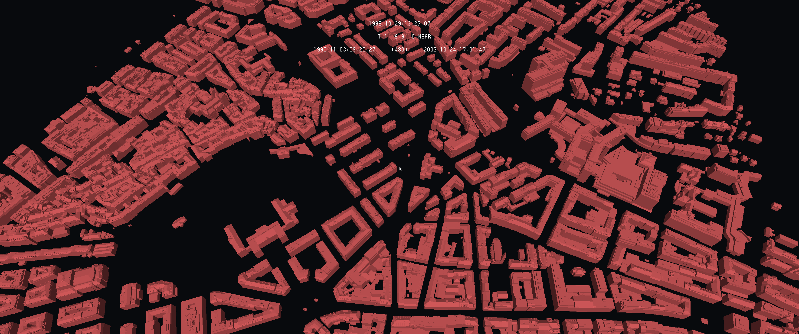

# Overview

This is converting obj, **.ply, .off, .stl, .mesh, .node, .poly** and **.msh** files to the uv3 file format. This is an important step in injecting data into the eratosthene platform. This code works with the PyMesh library and, therefore, is applied only to these types of meshes. Other codes will follow to include other mesh file formats. In the meantime, MeshLab (https://www.meshlab.net/) is a free software that can be used to convert between mesh file formats. Keep in mind that this code was thought mainly for the SITG dataset (https://ge.ch/sitg/donnees) and other scaling parameters may be applied if the case. It's also important to add that this wasn't thought to be used with general meshes, but with geospatially referenced meshes that will be injected into the Eratosthene Platform. 

## mesh-to-uv3

This code includes three arguments, the input mesh, the output uv3 path and a boolean one regarding whether swiss coordinate system CH1903+ is used or not. The example below shows how a simple conversion can be done with some different file formats. 

```
$ python mesh-to-uv3.py -i /home/usr/path/to/file.stl -o /home/usr/path/to/file.uv3

$ python mesh-to-uv3.py -i /home/usr/path/to/file.ply -o /home/usr/path/to/file.uv3 -s 1
```

As this code is thought mainly on swiss dataset, an automatic conversion from the **swiss coordinate system CH1903+ to WGS84** is available with the *--swiss* / *-s* argument. If stated as 1 (True), the conversion is made. Default is set to zero, False, so normally no conversions is made.

The picture below shows an example of an injection of a mesh file (.stl) in the platform.



### Scaling

For storing purposes, geographically referenced meshes usually use some scaling to the coordinate values. Unfortunately, this is not universal and depends on each file. The scaling of this code is made based on the SITG reference. If you have another file with another scaling, please change the following lines in the code (107 to 110):
```
 	#scaling of the coordinates - This is most probably changing from file to file. The usage below referes to SITG's datasets
        conv_vertex_1 = [(vertex_1[0] - 2480000) * -1, (vertex_1[1] - 1109000) * -1, vertex_1[2]]
        conv_vertex_2 = [(vertex_2[0] - 2480000) * -1, (vertex_2[1] - 1109000) * -1, vertex_2[2]]
        conv_vertex_3 = [(vertex_3[0] - 2480000) * -1, (vertex_3[1] - 1109000) * -1, vertex_3[2]]
```

As default no scaling is made to data. If scaling is necessary, please use the "--scaling" argument, as below:

```
$ python mesh-to-uv3.py -i /home/usr/path/to/file.stl -o /home/usr/path/to/file.uv3 --scaling 1
```
If changing the code as explained above becomes too tricky, do not hesitate on contacting us at info@stdl.ch

# Copyright and License

las-to-uv3 - Huriel Reichel Nils Hamel
Copyright (c) 2020 Republic and Canton of Geneva

This program is licensed under the terms of the GNU GPLv3. Documentation and illustrations are licensed under the terms of the CC BY-NC-SA.

# Dependencies 

Python 2.7 or superior

* Pymesh 2.0.3

Conda may properly install PyMesh, but it's not recomended. In https://pymesh.readthedocs.io/en/latest/installation.html you'll find deeper information on how to install PyMesh . The easiest way is probably through docker, as explained below:

* Have the input file to be converted in the same folder as the mesh-to-uv3.py script and navigate to this folder with cd in you computer's terminal.

```
$ cd /path/to/code/and/input_file/
```

* Once you're on the proper folder, run the docker image from PyMesh

```
/path/to/code/and/input_file/$ docker run -it --rm -v `pwd`:/models pymesh/pymesh bash
```
or maybe the following if in linux:

```
/path/to/code/and/input_file/$ sudo docker run -it --rm -v `pwd`:/models pymesh/pymesh bash
```

* Once rooted, do:

```
root@e53224f5136b:~# cd /models
```

And finally run the code as explained above.


