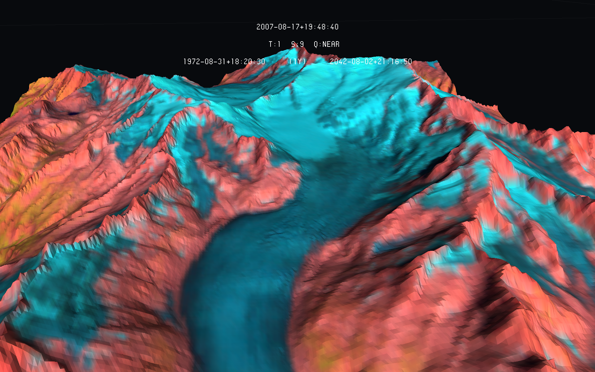

# tiff-poly-uv3
Retrieves RGB and Elevation values from two different geotiff and convert them into an uv3 polygon file. It can also be used for plane raster, this way not using elevation values from a second geotiff.

## Overview

This code retrieves both elevation and RGB values from two different geotiff. This is usually the case when one wants to visualise three-dimensional spatial data. One geotiff is usually a Digital Elevation Model (DEM) and the other, imagery with three different spectral bands. The output file (uv3) is addressed to the eratosthene platform. The difference of this tool to the RGB Geotiff with elevation from DEM to UV3 toolkit is that it transforms the points (centroid of every pixel) in polygons, giving a smoother appeareance to the final model.

It is recommended (as sometimes needed) that both geotiff cover the same area. They usually don't need to be equaly croped, as interpolation is applied, though this is recomended. The output file resolution is the same of the RGB imagery Geotiff used.

This code should work with multispectral imagery as well, though, as it only works with 8 bit files, in chase you have 16 bit (or even other) some conversions are needed. For that, we recommend you to use gdal directly in your terminal, as in the example below.

```
$ gdal_translate -of GTiff -ot Byte -scale 0 65535 0 255 /home/usr/path/to/input_geotiff.tif /home/usr/path/to/converted_geotiff.tif
```
### tiff-poly-uv3

There are three main arguments in this code. The **input** file is the RGB Geotiff, used as resolution reference as well. The **dem** argument refers to the elevation geotiff, and the **output** refers to the path to the output file. An usage example can be seen below.

```
$ python rgb-z-uv3.py -i /path/to/rgb_image.tif -d /path/to/dem.tif -o /path/to/output.uv3
```
If you don't have a Digital Elevation Model or prefer to work with plane raster, simply don't add the *dem* argument, such as below:

```
$ python rgb-z-uv3.py -i /path/to/rgb_image.tif -o /path/to/output.uv3
```

If you want to work with false-colour raster, you may want to replace the band being analysed by another. For example, if you are working with NIR (Near Infrared) imagery, usually the red band is replaced by the NIR band. If the NIR band was the first one (1), and followed by red (2), green (3) and blue (4), one can do this replacement with the *red*, *green* and *blue* arguments, as in the code below:

```
$ python rgb-z-uv3.py -i /path/to/rgb_image.tif -d /path/to/dem.tif -o /path/to/output.uv3 -r 1 -g 3 -b 4
```

Mind the fact that polygons in the platform may appear as very small models, what means that a big zoom is required to properly visualise them.

### Example

The following example is the Rhone Glacier, in Switzerland, which model was developed using the Swiss Data Cube imagery and SWISSALTI from swisstopo.



## Copyright and License

**rgb-z-uv3** - Huriel Reichel, Nils Hamel <br >

# Copyright and License
Copyright (c) 2021 Republic and Canton of Geneva

This program is licensed under the terms of the GNU GPLv3. Documentation and illustrations are licensed under the terms of the CC BY-NC-SA.

# Dependencies

Python 3.8.5 of superior

Packages may be installed either by pip or conda

* GDAL 3.2.0

* Numpy 1.19.4

