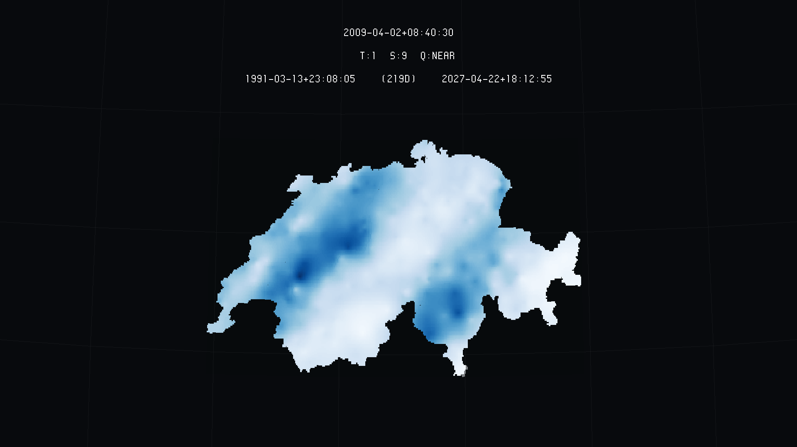

# z-from-geotiff
Extract height (or other variable - 3rd dimension) from geotiff and write it to uv3.

# Overview

This code works for extracting heights (or other 3rd dimensional variable) from geotiff and so forth writing the uv3 file out of these information. Another possible example of this code is interpolated models, with random variables like precipitation, some chemical presence, soil data, etc. Although, broadly, this was meant to elevation data. 

## z-from-geotiff

Whilst writing the uv3 files, you may either add or not the elevation values, so that the model will be three-dimensional or not. This rule applies to data that do not refer to elevation models as well. Colours will always be applied. 

As default, heights (Z values) will not be assigned, as below:

```
$python z-from-geotiff -i /home/user/path/to/geotiff.tiff -o /home/user/path/to/output.uv3
```

In the other hand, if you want to apply Z values to data, the argument *height* must be passed as True (1), which is also the default set up.

``` 
$python z-from-geotiff -i /home/user/path/to/geotiff.tiff -o /home/user/path/to/output.uv3 -height 1
```

### Colour palette

There's also the option of changing the colouring palette / colour map. As this code is using matplotlib's palettes, any of its palettes can be used here. For reference, look at https://matplotlib.org/3.3.2/tutorials/colors/colormaps.html

The default palette is 'inferno', but here's an example with some other famous palettes:

```
$python z-from-geotiff -i /home/user/path/to/geotiff.tiff -o /home/user/path/to/output.uv3 -p gnuplot
$python z-from-geotiff -i /home/user/path/to/geotiff.tiff -o /home/user/path/to/output.uv3 -height 0 -p twilight
```

In the picture below you have a Geotiff being coloured using different palettes. 

### Examples

In the picture below you have an injection of a geotiff with heights, of a geotiff with heights and coloured by the terrain palette, and and a geotiff without heights.


It is important to mention that raster with another 3rd dimensional variable can also be converted for injection through this code. As an example, the interpolated precipitation of Switzerland, which data and prediciton are fom the geoR package can be seen injected below:



# Copyright and License

z-from-geotiff - Huriel Reichel Nils Hamel
Copyright (c) 2020 Republic and Canton of Geneva

This program is licensed under the terms of the GNU GPLv3. Documentation and illustrations are licensed under the terms of the CC BY-NC-SA.

# Dependencies

Python 3.8.5 or superior.

Packages can be installed either with pip or conda.

* GDAL 3.2.0

* Numpy 1.19.14

* matplotlib 3.3.3
